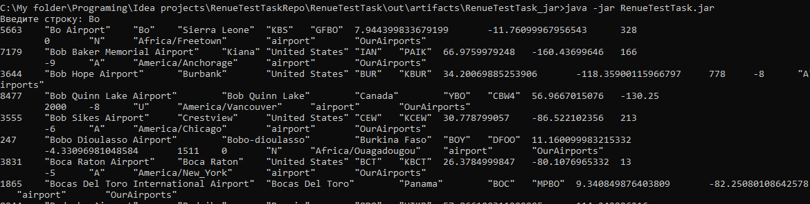
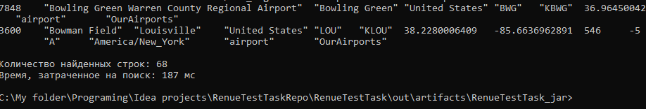
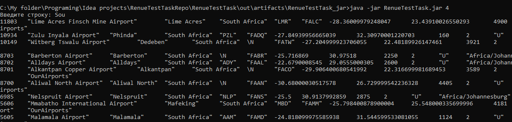
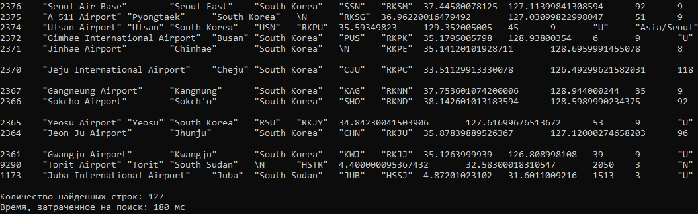

# RenueTestTask
Данная программа является тестовым заданием для набора на стажировку в компанию Renue.

## Пример запуска программы

Выше приведен пример запуска программы без параметров. При этом номер столбца, по которому производится фильтрация 
результатов, считывается из YAML файла.
Пример запуска программы с явно заданным параметром:

## Архитектура программы

Программа была реализована с использованием паттерна проектирования MVC. Компонент View отвечает за консольный ввод и 
вывод, компонент Model - за представление и работу с данными (файлом с информацией об аэропортах), компоненте Controller 
является прослойкой между двумя вышеперечисленными компонентами (конкретно в данном случае представляется малополезным, 
но в случае расширения функционала программы может сделать дальнейшую разработку более удобной).